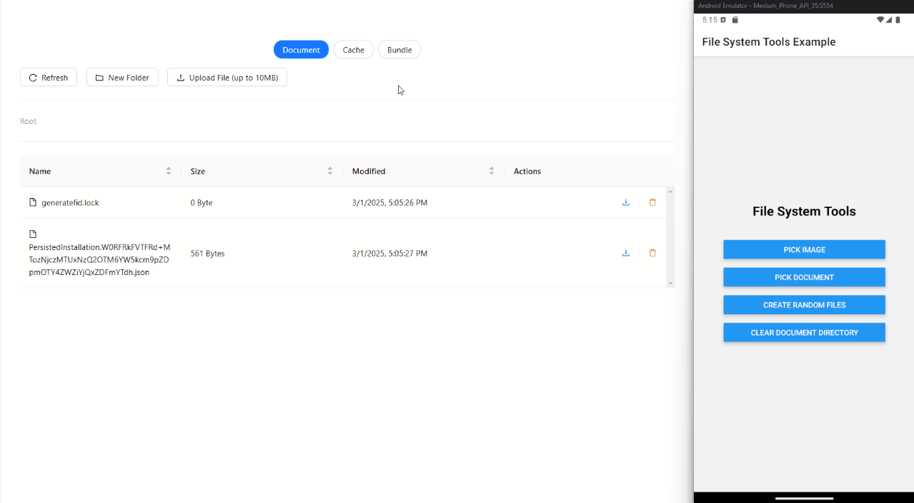

# File System Expo Dev Plugin

A DevTools plugin for managing and viewing the file system in Expo Go and Expo development projects.



## Features

- Easily navigate and inspect the file system directly within Expo DevTools
- Perform file operations such as reading, writing, and deleting without extra setup
- Supports both Expo Go and Expo Dev Client for seamless integration
- Provides a lightweight and efficient way to test file storage during development

## Installation

### Managed Expo Projects

For managed Expo projects, follow the installation instructions in the [API documentation](https://docs.expo.dev/versions/latest/sdk/file-system-dev-plugin/). If the documentation is unavailable, the library may not yet be officially released in an Expo SDK.

### Bare React Native Projects

Ensure you have installed and configured the [`expo` package](https://docs.expo.dev/bare/installing-expo-modules/) before proceeding.

Install the package with:

NPM

```sh
npm install file-system-expo-dev-plugin
```

Yarn

```sh
yarn add file-system-expo-dev-plugin
```

## Motivation

This plugin was created to provide a simple tool for quickly opening and manually testing files and folders created in Expo projects. The goal was to avoid the need for additional utility implementations or external tools, making file system interactions more convenient.

## Usage

Once installed, the plugin will be available in the Expo DevTools interface, allowing you to interact with the file system in your Expo project.

## API Documentation

- [Latest stable release](https://docs.expo.dev/versions/latest/sdk/file-system-dev-plugin/)
- [Main branch documentation](https://docs.expo.dev/versions/unversioned/sdk/file-system-dev-plugin/)

## Contributing

Contributions are welcome! Please follow the standard contribution process, including forking the repository, making changes in a feature branch, and submitting a pull request.

Extra: [Expo contributing guide](https://github.com/expo/expo#contributing)

## License

This project is licensed under the MIT License. See the [LICENSE](LICENSE) file for details.
